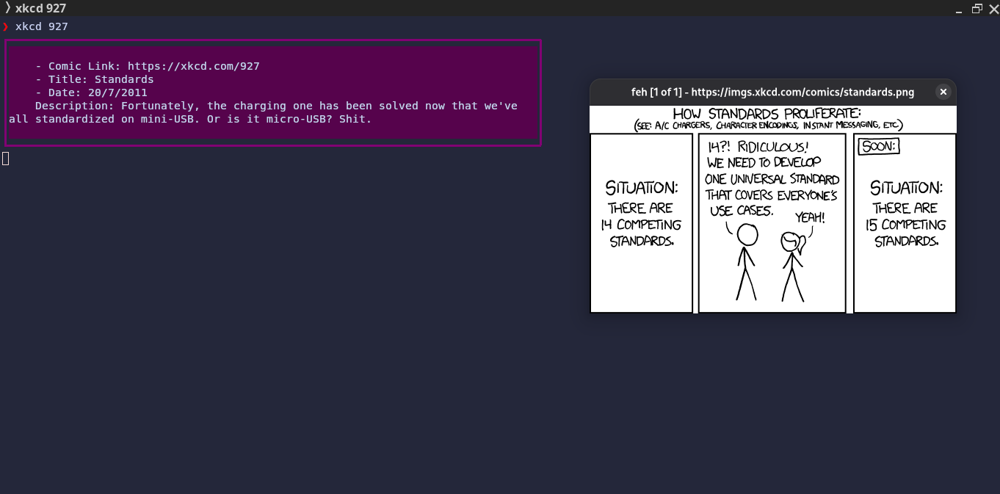

# xkcd-cli

[](https://golang.org)
[](https://github.com/isa-programmer/xkcd-cli/releases)
[](LICENSE)

A command-line interface for [xkcd.com](https://xkcd.com/) comics.

## Features

- Fetch and display XKCD comics right in your terminal
- Cross-platform support: Linux, macOS (Intel and Apple Silicon)
- Simple and fast


## Example screenshot


## Installation

### Download pre-built binaries

Grab the latest release for your platform from the [Releases page](https://github.com/isa-programmer/xkcd-cli/releases):
- **Linux (amd64)**
- **macOS (amd64)**
- **macOS (ARM64)**

Example for Linux:

```sh
wget https://github.com/isa-programmer/xkcd-cli/releases/latest/download/xkcd-linux-amd64
chmod +x xkcd-linux-amd64
./xkcd-linux-amd64
```

### Build from source

Requires Go 1.22+:

```sh
cd xkcd
go build -o xkcd
./xkcd
```

## Usage

```sh
xkcd [options]
```

### Example commands

- Show latest comic:

  ```sh
  xkcd
  ```

- Show a random comic:

  ```sh
  xkcd random
  ```

- Fetch a specific comic by number:

  ```sh
  xkcd 927
  ```

## License

This program licensed with GPLv3. See [LICENSE](LICENSE) for details.

## Credits

- [xkcd.com](https://xkcd.com/) for the awesome comics!
